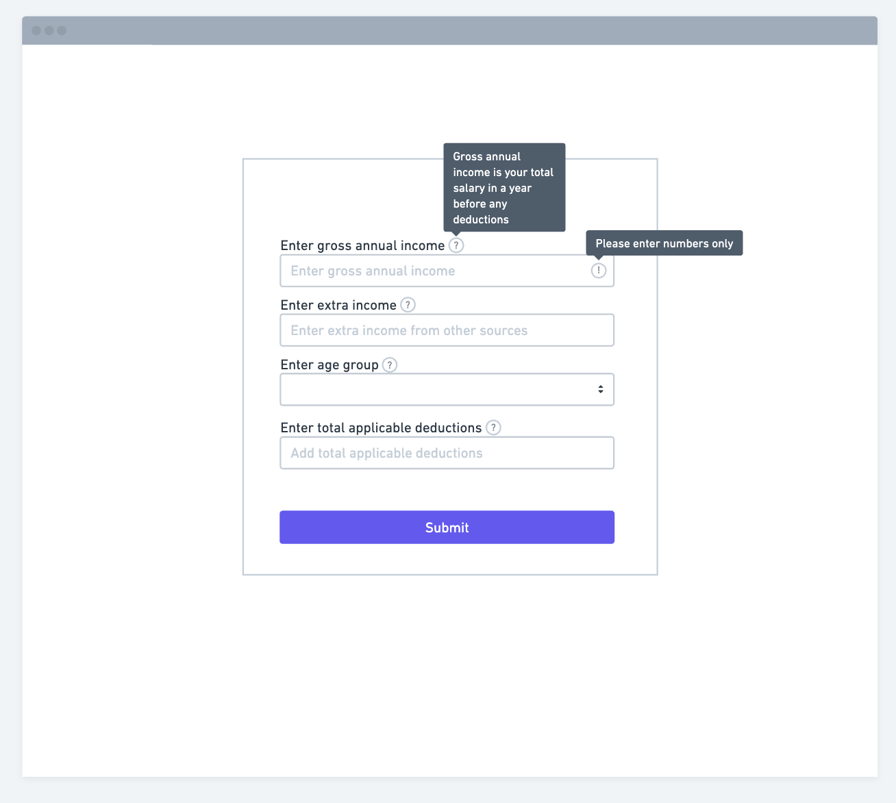
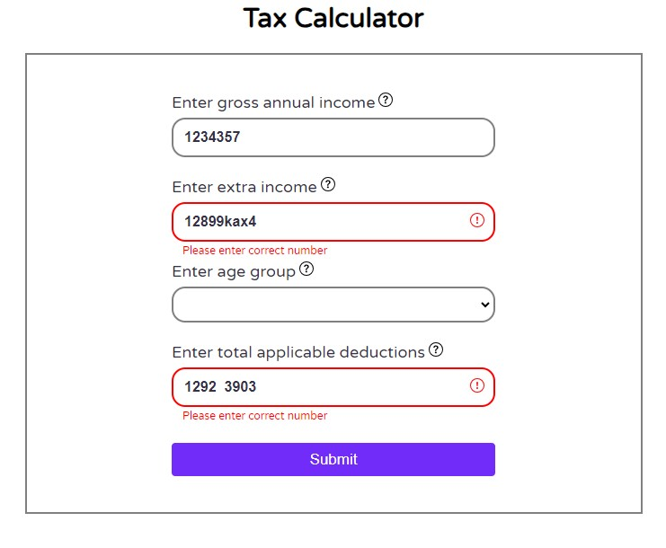
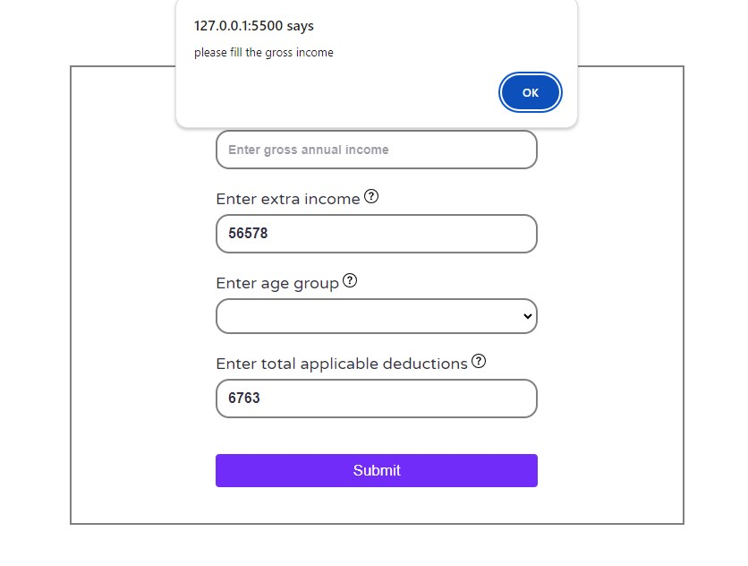
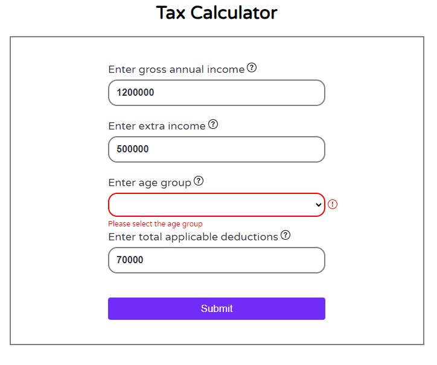
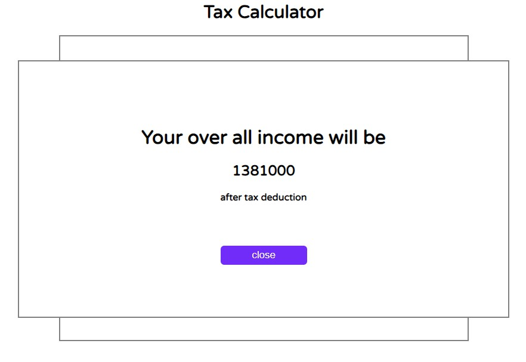

# Tax Calculator

## Welcome! 👋

Thanks for checking out this front-end coding challenge.

**To do this challenge, you need a good understanding of HTML, CSS and JavaScript.**

## The challenge

The challenge is to build out this Tax calculator app as shown in the picture and modification is allowed.

Tools used to create this app are HTML, CSS and JavaScript.

Users are able to:

-Give input in all the fields.
-Get the information about the field by hovering over the question mark.
-Get the Total income after the tax deduction.

Note - Filling the gross income and sellecting the age group is mandatory.

## Each and every case scenario is shown.

**Case 1**
If user gives the incorrect input error sign pops up.

**Case 2**
If user submits the form without filling the gross income filed a alert message is shown.

**Case 3**
If user submits the form without sellecting the age group a error message is shown.

**Case 4**
If user fills the necessory fields correctly the total income after the tax deduction is shown.

 

